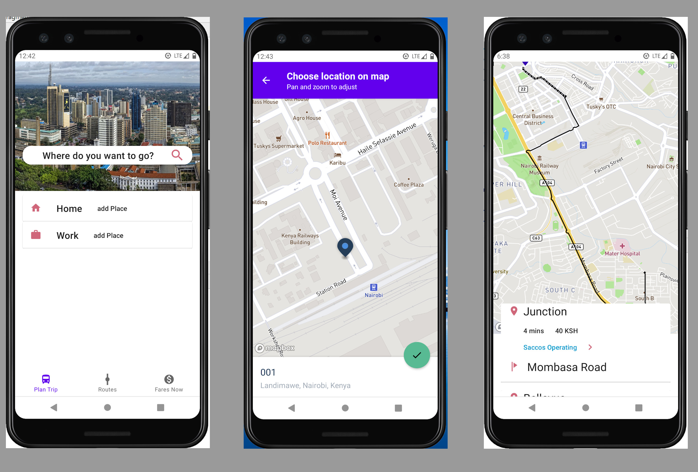

# Digital Matatu App  


This is a mobile app that provides navigation assistance to commuters in Nairobi using public transits(called Matatus in Kenya).

This project aims to:
  - Enable commuters plan their trips, by proving realtime data of fares and transits available in routes that the user wants to use.
  - Offer fare comparison where more than one agency offers commuting services.
  - Search for available trips and inform user by providing navigation information including how long the trip will take.

The above details enables using public transport in Nairobi more accessible and reliable.

  - - -  
  
Setup of the Server
------------------
This project uses GTFS data of Nairobi, which can be download [here](http://www.digitalmatatus.com/).

It uses [Open Trip Planner](https://www.opentripplanner.org/) for providing routing information.

Run the script ```buildGraph.sh``` to build a graph of mapping of gtfs data and the map of Nairobi.  
Run the script ```startServer.sh``` start the server.  

More details are found in the corresponding scripts ```buibuildGraph.sh``` and ```startServer.sh```
  


