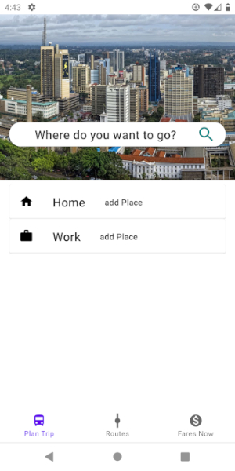
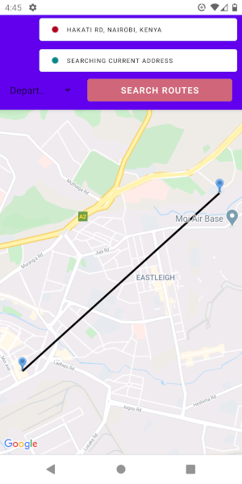
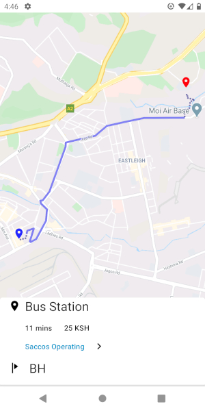
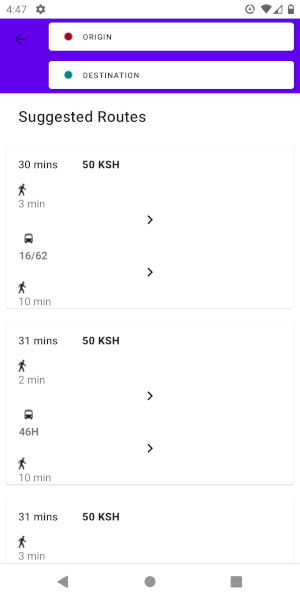
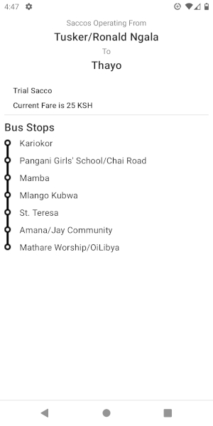

# Digital Matatu App  

I originaly developed this app during a Digital Matatu Hackathon.  

The requirements were to develop a solution that:  
  - Records fare for different routes that PSVs operate in Nairobi. 
  [Map of the Routes](http://www.digitalmatatus.com/map.html "Digital Matatu Data").
  - Enable commuters to be able to know fare for routes.
  - Commuters be able to do comparisons on the fares for the different agencies offering commuting services on those roads.  
  
  - - -  
  
The app provides the stated requirements.
  
ScreenShots
===========

Welcome Screen
  
  

Plan Trip Screen
  

Search Results.

Buses and Fares for Routes to the destination

Bus Stops and Saccos/Agencies offering transport services

